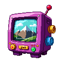

# GrabIt



A lightweight Windows screenshot + annotation tool. Single `.exe`, lives in
the system tray, launches with Windows.

If GrabIt is useful to you, you can support development here:
[☕ Buy me a coffee](https://buymeacoffee.com/matthewafay).

## What's new in 1.2

### Arrow — full style kit
- **Line style**: Solid / Dashed / Dotted. Dashes survive along curves
  (they're walked by arc length, not per polyline segment).
- **Head style**: filled Triangle (default) / outline Triangle / Line
  chevron / No head / Double-ended.
- **Round caps** on the shaft — every capsule segment ends with a clean
  semicircle instead of a hard cut. Visible on thick arrows, dashed
  arrows, and `Head = None`.
- **Curved arrows** — when an arrow is selected, a cyan mid-handle
  appears between the two endpoint handles. Drag it to bend the arrow
  into a quadratic bezier; drag the handle back toward the line to
  straighten. Body-drag moves the whole curve; every line/head style
  applies to curves too. The head's orientation follows the curve
  tangent at the tip.
- **4× supersampled export** — arrow rasterisation now renders into a 4×
  offscreen buffer and downsamples, giving smooth edges at every angle in
  the saved PNG and the clipboard image.
- All new style fields round-trip through the `.grabit` sidecar
  (serde defaults keep pre-1.2 arrows loading as solid filled-triangle
  straight lines).

### Text
- **Resize while editing** — eight blue-outlined handles appear around
  the text rect while it's in edit mode; drag a corner or edge to resize
  the box. Word-wrap re-runs live as you drag.
- **Double-click to re-edit** — from any tool, double-click a committed
  text annotation to jump into edit mode on it. Tool switches to Text,
  the toolbar re-seeds from the node's current size/color/align/list/
  shadow/frosted, and the existing node is updated in place on commit.
- **List cursor fix** — typing inside a bullet/numbered text box no
  longer drifts the caret. Markers are applied at render/export time
  only; the live edit layouter uses the raw buffer so cursor indices
  map 1:1 to the string.

### Editor UX
- **Two-row toolbar** — tool selection on row 1, style controls on row 2.
  Each row wraps independently, so adding a tool never shoves style
  controls off-screen on a narrow window.
- **Editor window minimum size** — a tiny capture (e.g. 1×1 px) now
  opens a ≥1000×700 window with a hard 800×550 shrink floor, so toolbar
  + inspector + status always have room.
- **No more "unsaved changes" prompt after copy-to-clipboard** — a
  successful clipboard copy clears the dirty flag; subsequent edits
  re-arm the prompt as usual.

### Settings window
- **Reorganised into sections** — Hotkeys, Capture, Arrows. Each has a
  bold heading, its own grid, and separators between groups.
- **Click-to-record hotkeys** — click the field showing the current
  chord, press the combo you want, then Confirm. Esc cancels. The
  captured chord formats as `parse_chord` expects, so validation always
  accepts it.
- **Credit footer** — `GrabIt 2026 — Matthew Fay` pinned to the bottom
  right of the Settings window.
- **Arrow snap setting removed** — Shift always snaps to 15°; the
  modifier convention made a toggle redundant. Existing
  `settings.json` files with the field are read and quietly upgraded.

### Slim tray menu
The tray menu is down to 5 items: **Capture fullscreen**, **Capture &
annotate…**, **Open output folder**, **Settings…**, **Quit GrabIt**.
The two capture entries show their bound hotkey chord on the right
side via a muda Accelerator. Launch-at-startup moved into the Settings
window (Capture section).

### Hotkeys don't get swallowed by menus
- **Dedicated hotkey-drain thread** — `WM_HOTKEY` events are processed
  on a worker thread, so a modal UI on the main thread (our own tray
  popup, Windows context menus) can't delay dispatch.
- **Captures run on the worker** — `CaptureFullscreen` and
  `CaptureAndAnnotate` execute inline in the worker. Settings are
  re-read from disk per capture so include-cursor / copy-to-clipboard
  are always current.
- **Capture-first frozen overlay for Annotate** — the full virtual
  desktop is BitBlt'd *before* the region overlay shows. The overlay
  paints that captured bitmap as its opaque background (dimmed outside
  the drag rect, full-brightness inside). Windows naturally dismisses
  any open popup menu when the overlay takes focus, but because the
  overlay is showing the frozen capture, transient UI — tray menus,
  context menus, hover tooltips — is preserved in the final image.
  The selected rect is cropped out of the already-captured bitmap.

## What's new in 1.1

- **Arrow polish** — shaft now renders as a proper anti-aliased line stroke
  (no more "soft" freehand arrows at oblique angles); the head stays a clean
  triangle.
- **Color-derived drop shadow on arrows** — optional per-arrow shadow is a
  darkened tint of the arrow's own colour, so it reads on both light and
  dark backgrounds. Toggle per-arrow from the toolbar or globally in
  Settings ("Default new arrows to drop shadow").
- **Shift-drag snaps arrows to 15°** — freehand by default; hold Shift
  mid-drag to lock the angle and pixel-snap endpoints.
- **Arrow color: simple vs. advanced mode** — simple mode (default) shows
  an 8-swatch palette (red, orange, yellow, green, blue, purple, black,
  white). Advanced mode unlocks the full picker plus a `#RRGGBB` hex input
  field. Toggle under Settings → "Arrow color — advanced mode".
- **Settings now persisted as JSON** — `%APPDATA%\GrabIt\settings.json`
  replaces the old `settings.toml` (the old file still migrates in on
  first launch).
- **Live settings reload** — change a setting in the Settings window and
  any already-open editor picks up the new values immediately; no restart
  required.
- **Copy-path button** — after a successful save, a one-click "Copy path"
  button next to the "Saved to …" status copies the full PNG path to the
  clipboard for pasting into chat / Explorer / a prompt.

## Capture

- **Fullscreen** — `PrintScreen` or tray → *Capture fullscreen*. Saves PNG
  to the output folder and copies to clipboard.
- **Region / window** — tray → *Capture region / window…*. Drag a rectangle
  in the overlay, or hover a window (green outline) and click to grab it.
  Multi-monitor and mixed-DPI aware.
- **Annotate** — `Ctrl+X` or tray → *Capture & annotate…*. Drag-release a
  rectangle, then the editor opens with it.
- **Object / menu** — tray → *Capture object…*. A UIA picker highlights the
  UI element under the cursor (button, menu item, list row); F3 commits,
  Esc cancels. Menus stay pinned via a `SetWinEventHook` while you hover.
- **Exact size** — tray → *Capture exact size…* → pick a preset
  (1920×1080, 1600×900, 1280×720, 1024×768, 800×600, 640×480, 500×500). An
  overlay lets you position the fixed-size rectangle.
- **Delayed** — tray → *Capture with delay* → 3 / 5 / 10s. A countdown
  appears and closes before the capture fires.
- **Presets** — tray → *Presets*. User-defined capture profiles bundling
  target, delay, cursor, post-action, filename template. Each can bind its
  own global hotkey.

Every capture saves both a PNG and a `.grabit` sidecar (the editable scene
graph) next to it.

## Editor

Tools:

- **Select** — click any annotation to select, drag body to move, drag
  any edge or corner handle to resize (edges work along their full length,
  not just the midpoint). Drag different annotations without deselecting
  first. Delete removes. Ctrl+Z / Ctrl+Y for undo/redo.
- **Arrow** — drag tail-to-tip; shaft is draggable anywhere along its
  length for move, endpoints for retargeting.
- **Text** — drag a rectangle to define the text box, type inside. Enter
  adds a newline, text word-wraps at the right edge, Esc or clicking
  outside commits. Click an existing text rect to re-edit.
  - **Frosted** — gaussian-blur the pixels behind the text box (same
    effect as the Blur tool), so text stays legible over any background.
  - **Shadow** — soft offset drop shadow behind the text box for a
    floating-card look. Pairs well with Frosted.
  - **Align** — Left / Center / Right horizontal alignment inside the box.
  - **Lists** — toggle off / bullet (`•`) / numbered (`1.`) list style;
    wrapped continuation lines hanging-indent to the text column in the
    exported PNG.
  - JetBrains Mono at the chosen size.
- **Callout** — drag a rect; produces a speech-balloon with a movable tail.
- **Rect / Ellipse** — drag a shape with stroke + optional translucent fill.
- **Step** — click to place numbered markers; auto-increment per document.
- **Magnify** — drag over the region you want zoomed; a 3× loupe callout
  appears next to it. Circular toggle. Live preview shows the real zoom.
- **Blur** — drag a region. Non-destructive in `.grabit`, destructive on
  PNG export. Live preview shows the real gaussian.
- **Capture-info stamp** — pin a banner with timestamp / window title /
  process / OS version / monitor info. Real metadata, live preview.

Document-level effects (right inspector panel):

- **Torn edge** — jagged cut on any of the four edges. Live preview.
- **Border + drop shadow** — solid frame with optional soft shadow. Live
  preview.
- **Resize** — aspect-locked width/height inputs; Reset to base size.
- **Rotate** — 90° CW / CCW buttons; Shift+R shortcut.

Undo/redo via command pattern (Ctrl+Z / Ctrl+Shift+Z / Ctrl+Y), bounded at
200 entries. Ctrl+S saves. Closing with unsaved edits prompts
Save / Discard / Cancel.

Quick styles (inspector → Styles tab): save the active tool's settings
as a named style and reapply later. Styles persist at
`%APPDATA%\GrabIt\styles.toml`.

## Settings

Tray → *Settings…* opens a GUI window grouped into three sections:

- **Hotkeys**
  - Fullscreen capture (default `PrintScreen`)
  - Annotate (default `Ctrl+X`)

  Click a field and press the combo you want, then Confirm. Esc cancels.
- **Capture**
  - Launch at startup
  - Include cursor in captures
  - Copy every capture to clipboard
  - Output folder (default `%USERPROFILE%\Pictures\GrabIt`, with Browse / Reset)
- **Arrows**
  - Default new arrows to drop shadow
  - Arrow color — advanced mode (picker + hex)

  *Tip: hold Shift while dragging an arrow to snap to 15°.*

Save writes `%APPDATA%\GrabIt\settings.json` and signals the tray to
re-register hotkeys and re-sync autostart without restart. Any open editor
also live-reloads its arrow/shadow flags.

> Global hotkeys win over focused apps — while the annotate hotkey is
> `Ctrl+X` it intercepts Cut everywhere. Pick something unique (e.g.
> `Ctrl+Shift+X`) if that bothers you.

## Setup

### Rust toolchain

Install Rust via [`rustup`](https://rustup.rs/). On Windows open PowerShell
and run:

```powershell
# Installer prompt — accept the defaults (it picks the MSVC toolchain).
winget install Rustlang.Rustup
# or download + run: https://win.rustup.rs/x86_64
```

Then add the stable toolchain and make sure it targets MSVC:

```powershell
rustup install stable
rustup default stable-x86_64-pc-windows-msvc
```

Verify: `cargo --version` should print `cargo 1.78` or newer.

### Visual Studio Build Tools

GrabIt links against the Windows SDK and the MSVC CRT. Install the
"Desktop development with C++" workload via Visual Studio Installer (the
free **Build Tools for Visual Studio** SKU is enough). The Rust installer
offers to do this for you on first run — accept if prompted.

### Build

From the repo root:

```powershell
cargo build --release
```

Produces `target\release\grabit.exe`, a self-contained Windows binary
around 5 MB (statically linked CRT, LTO, stripped). Run it directly; no
installer is required.

If a build fails with `error: failed to remove file … Access is denied`,
a previous `grabit.exe` is still running. Quit it from the system tray
(and close any open editor / settings windows — each is a subprocess of
the same `.exe`) and rerun.

## Use

Run `grabit.exe`. The logo appears in the system tray. Right-click for the
menu. Toggle **Launch at startup** in the Settings window to add/remove the
`HKCU\Software\Microsoft\Windows\CurrentVersion\Run\GrabIt` entry.

Output folder: configurable in Settings (default `%USERPROFILE%\Pictures\GrabIt`).
Settings / presets / styles / logs: `%APPDATA%\GrabIt\`.

## Architecture

```
src/
  main.rs              entry + subprocess dispatch (--editor, --settings);
                       single-instance mutex; DPI + font init; event loop
  app/                 AppState, command dispatch, paths
  tray/                tray icon + menu (capture / presets / settings / quit)
  hotkeys/             global-hotkey registration, chord parser, runtime rebind
  autostart/           HKCU Run-key read/write
  platform/            DPI, monitor enumeration, JetBrains Mono font registration
  capture/
    gdi.rs             GDI BitBlt (fullscreen / region)
    window_pick.rs     PrintWindow(PW_RENDERFULLCONTENT)
    cursor.rs          GetCursorInfo + DrawIconEx → separate cursor layer
    region.rs          layered-window overlay (drag / window-hover)
    exact_dims.rs      fixed-size positioner overlay
    object_pick.rs     IUIAutomation element picker + WinEventHook menu pin
    delay.rs           countdown overlay
    wgc.rs             Windows.Graphics.Capture hooks (GDI fallback active)
  editor/
    app.rs             eframe App: toolbar + canvas + tool palette
    document.rs        Document schema (.grabit, MessagePack)
    commands.rs        command-pattern undo/redo history (bounded 200)
    rasterize.rs       flatten annotations + effects onto PNG export
    tools/             one module per tool
  presets/             per-preset .toml records + hotkey rebinding
  styles/              named quick-style presets per tool
  settings/
    mod.rs             settings.json load/save (legacy settings.toml auto-migrates)
    ui.rs              eframe GUI for the --settings subprocess
  export/              PNG write + Windows clipboard (CF_DIB)
```

Each editor and settings window runs as its own `grabit.exe` subprocess
(`--editor <sidecar>` or `--settings`) because winit 0.30 refuses to
recreate its event loop inside one process — the tray would deadlock after
the first editor close otherwise. Subprocesses communicate with the tray
via marker files under `%APPDATA%\GrabIt\` (one-shot reloads for settings,
presets, and triggered preset captures).

## Credits

- **Logo:** pixel-art TV by the project owner.
- **Font:** [JetBrains Mono](https://www.jetbrains.com/lp/mono/) Regular &
  Bold, SIL Open Font License 1.1. License text: `assets/fonts/OFL.txt`.
- **Rust crates** (runtime): `windows`, `eframe` / `egui`, `tray-icon`,
  `global-hotkey`, `image`, `imageproc`, `fast_image_resize`, `ab_glyph`,
  `winreg`, `toml`, `serde_json`, `rmp-serde`, `serde`, `chrono`, `parking_lot`,
  `crossbeam-channel`, `anyhow`, `thiserror`, `log` / `env_logger`,
  `uuid`, `rfd`, `dirs`.
- **Rust crates** (build): `embed-resource`, `ico`, `image`.
